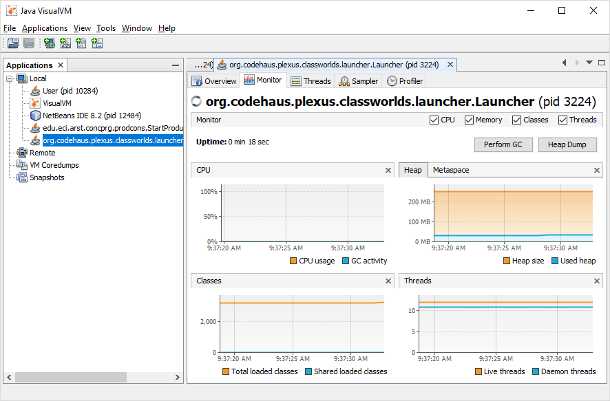
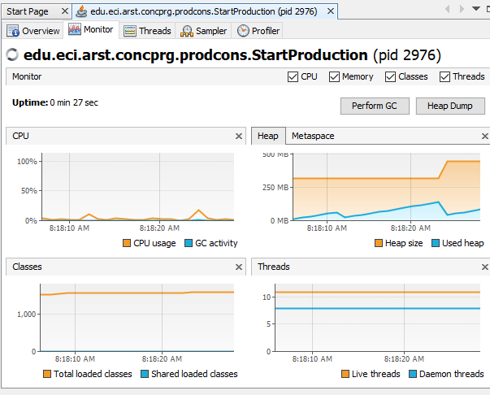

# Laboratorio#4 Arsw

Nombre: 
* Sergio Alejandro Peña Pinto

## *Part I.*
1. It is making use of 13.7% of the CPU, one of the threads is performing unnecessary operations, consuming resources unnecessarily. 

The consumer process, since it is consulting the size of the queue repeatedly, when it is already known that due to the speed of production of the producing thread, it will be emptied very quickly, causing the waste of resources.

2. 

3.

## *Part II.*

The same class from the previous laboratory was put in because, as it had been implemented, it meets the needs of the current one.

## *Part III.*

* The value corresponds to N * 100
* The invariant is not fulfilled since it shows different values to which it corresponds.
* Although the functionalities for the pause and check options were implemented and the resume is not maintained, it usually occurs in cases where there are many immortals.
* The critical region is presented at the moment when the immortal fight (fight method) because as the life of the attacker and the attacker is changed, it may be the case where more than one thread is changing these values in the same moment of time.
* Implementation pause, resume and stop:

